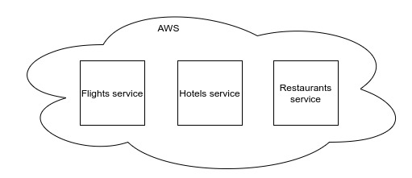
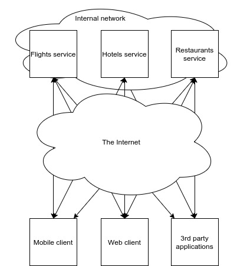
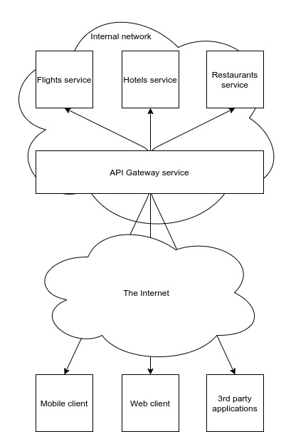

## Problem

Consider the fictional company **TravelHelper (TH)**. TH helps its users plan
their vacations. TH has been growing over the past few years, and as a result,
so has its application. The TH backend consists of microservices running on AWS.

Just to name a few, TH's backend consists of

- Flights service
- Hotels service
- Restaurants service

These services are developed by individual engineering teams and are deployed
autonomously.



TH is trying to figure out how their web and mobile clients will interact with
their backend. After reading
[Make Your Product a Platform](/blog/platform-product), they also want to open
their APIs to 3rd party developers.

## Solution 1

One way they could accomplish the task is by having clients interact with
backend services directly.



However, this architecture results in a few problems discussed below.

### Complexity on Clients

Clients might have to aggregate data returned by multiple services in order to
get the data in a format that can be used by the client application. As a
result, the client application could become more complex. What's more, this
aggregation process distracts from the main task of building an amazing user
experience.

### Network Overhead

<aside>
  <p>
    Apparently, Amazon did a study and found that&nbsp;
    <ExternalLink href="https://www.gigaspaces.com/blog/amazon-found-every-100ms-of-latency-cost-them-1-in-sales">
      every 100ms of latency cost them 1% in sales
    </ExternalLink>.
  </p>
</aside>

The architecture proposed in Solution 1 would require that clients make multiple
round trips over the Internet when communicating with backend services. This
could add hundreds of milliseconds to your application load times depending on
how much data needs to travel over the Internet and how far that data needs to
go.

### Lack of Flexibility

The Solution 1 architecture also exposes the service APIs to clients directly.
This can make it costly, if not impossible, to upgrade individual service APIs
in the future. This is because it is hard to know which client applications in
the wild still depend on your backend service APIs, especially when the APIs are
open to 3rd-party developers.

After much discussion with Engineering, TH seeks an alternative solution.

## Solution 2

TH decided they think it would be beneficial to introduce a shim layer between
the clients and backend microservices. They introduce an **API Gateway** between
the clients and services.



This API Gateway will

- Provide an interface for clients to interact with backend services
- Aggregate results from multiple backend services before responding to clients
- Handle authentication and authorization

### Interface

With an API Gateway, network overhead can reduce as clients only need to make a
single round trip over the Internet to reach the API Gateway. Then, the API
Gateway service can efficiently handle communicating with backend services in a
local network before responding to the client.

### Aggregation

Before the API Gateway responds to clients, it can efficiently aggregate data
provided by multiple service APIs. Handling aggregation on the server would
likely simplify and improve the performance of client applications.

### Security

With Solution 1, individual services might have had to figure out a story for
handling authentication and authorization. Authorization and authentication
could be handled at the API Gateway, simplifying individual backend services.

## Implementation

TH liked the API Gateway pattern, so they decided to implement Solution 2. For
implementing an API Gateway, there are 2 popular options:

- REST
- GraphQL

### REST

Defined in
[2000 by Roy Fielding in his doctoral dissertation](https://en.wikipedia.org/wiki/Representational_state_transfer),
REST can be used in the implementation of the API Gateway service. In REST, a
client

- Makes request to a URL such as `https://api.travelhelper.app/trips`
- Specifies an HTTP verb such as `GET`, `POST`, `PUT`, or `DELETE`.
- Optionally provides a body: data for the server to use for the request.

Suppose for example, a client wants to fetch a **Hero** with an id of **1**. A
client can perform the following request to the API Gateway.

```
GET https://api.travelhelper.app/hero/1
```

The API Gateway can then coordinate with the other services to get the data it
needs for the request before returning the following response to the client.

```json
{
  "hero": {
    "id": 1,
    "name": "R2-D2"
    // ...and possibly more key/value pairs
  }
}
```

### GraphQL

An alternative approach to implementing the API Gateway is to use GraphQL, which
was developed by Facebook in 2015. With GraphQL, clients can specify exactly the
data it needs from the server. For example, a client can make a request to the
API Gateway with the following GraphQL query.

```
{
  hero(id: "1") {
    name
  }
}
```

The API Gateway service can then take this schema and communicate with other
backend services in order to resolve the query before returning the following
JSON to the client.

```json
{
  "data": {
    "hero": {
      "name": "R2-D2"
    }
  }
}
```

A lot more can be said about GraphQL. Check out their
[documentation](https://graphql.org/) to learn more.

After much discussion among the engineering teams, TH decided to move forward
implementing GraphQL for the API Gateway service for reasons that are beyond the
scope of this article.

## Conclusion

In this article, we learned how an API Gateway can be used to

- Provide an interface between client and server
- Aggregate data returned by individual microservices
- Act as a security layer between clients and services

### Read more

There is more to API Gateway than what was discussed here, such as the
[Backends for Frontends pattern](https://microservices.io/patterns/apigateway.html).
The book
[Microservices Patterns](https://www.manning.com/books/microservices-patterns)
and the supplementing [website](https://microservices.io/) has more to say on
API Gateway, and on microservices in general.

[Let me know on Twitter](https://ctt.ac/FVr83) what you thought of the article
and I hope you have a good day.
