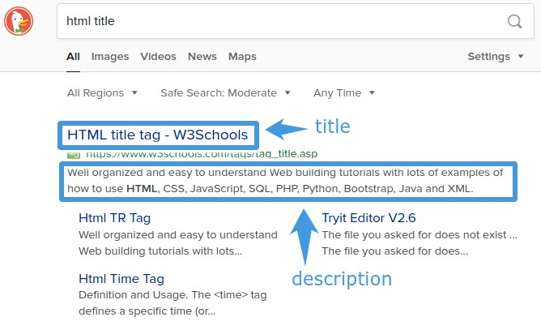

You just built your website. Now you want to show the world. Let's say you go to
Twitter to share a link to your website. You probably don't just want underlined
blue text for your link. You might want a card that **grabs people's
attention**. Something like the following:


Doing this is simple. We need to add **metadata** to the
[head](https://developer.mozilla.org/en-US/docs/Web/HTML/Element/head) of the
HTML document on your web page. We will build up a document head from scratch to
demonstrate.

## The Basics


First, we want a **title** and a **description** for our webpage. A title is
what users see on the browser tab for your website. The title and description
are also used to tell people what your site is about when your site pops up in
search engine results.



To accomplish this, we will use the `<title>` tag and the `<meta>` tag.

<aside>
<p>
A <strong>meta tag</strong> is commonly of the form:
</p>
<pre>
&lt;meta name="name" content="content" /&gt;
</pre>
</aside>

We update our head to the following:

```html
<head>
  <!-- Basic tags -->
  <title>My Awesome Title</title>
  <meta
    name="description"
    content="This article talks about how to make links to your website look awesome on social media"
  />
</head>
```

Next, we will look at the [Open-Graph Protocol](https://ogp.me/), which will
give us the metadata we need to make links to our site look **awesome** when
they are shared on social media websites like Facebook.

## Open-Graph


We will follow a similar procedure of adding metadata. Open-Graph metadata is
used by social media sites to make a **card** from the link to your site.

<aside>
<p>
Open-Graph meta tags are of the following form. Notice, we use <strong>property</strong> instead of <strong>name</strong> here.
<pre>
&lt;meta property="og:name" content="content" /&gt;
</pre>
</p>
</aside>

Following the advice of the documentation, we will add the **four required meta
tags**. Our head now looks like

```html
<head>
  <!-- Basic tags -->
  <title>My Awesome Title</title>
  <meta
    name="description"
    content="This article talks about how to make links to your website look awesome on social media"
  />

  <!-- Open-Graph tags -->
  <meta property="og:title" content="My Awesome Title" />
  <meta property="og:type" content="website" />
  <meta property="og:url" content="https://skies.dev" />
  <meta property="og:image" content="https://skies.dev/image.jpg" />
</head>
```

With this metadata on the head of our site, we could share our link on services
such as Facebook or Discord, and our link would display as a card that shows the
title, description, and image that we specified. Facebook provides a
[debugger](https://developers.facebook.com/tools/debug) to test if the metadata
can be parsed to generate a card.

Next, we'll look at how we can make our links look awesome on Twitter, as they
have their own Twitter-specific meta tags.

## Twitter


We now turn to
[Twitter's documentation](https://developer.twitter.com/en/docs/tweets/optimize-with-cards/overview/abouts-cards)
to learn how to turn links to our site into cards. We follow a similar procedure
as before.

<aside>
<p>
Twitter meta tags are of the following form:
<pre>
&lt;meta name="twitter:name" content="content" /&gt;
</pre>
</p>
</aside>

Our document's head now becomes

```html
<head>
  <!-- Basic tags -->
  <title>My Awesome Title</title>
  <meta
    name="description"
    content="This article talks about how to make links to your website look awesome on social media."
  />

  <!-- Open-Graph tags -->
  <meta property="og:title" content="My Awesome Title" />
  <meta property="og:type" content="website" />
  <meta property="og:url" content="https://skies.dev" />
  <meta property="og:image" content="https://skies.dev/image.jpg" />

  <!-- Twitter tags -->
  <meta name="twitter:card" content="summary_large_image" />
  <meta name="twitter:title" content="My Awesome Title" />
  <meta
    name="twitter:description"
    content="This article talks about how to make links to your website look awesome on social media."
  />
  <meta name="twitter:image" content="https://skies.dev/image.jpg" />
</head>
```

Now, when we share our link on Twitter with this metadata in our head, we should
see a large card. Twitter provides a
[card validator](https://cards-dev.twitter.com/validator) so you can test your
link before tweeting.

If the card validator doesn't seem to update even after updating your metadata,
then you may need to force Twitter's cache to invalidate. See this
[StackOverflow post](https://webmasters.stackexchange.com/a/126166) for more
information.

<aside>
<h2>Important</h2>

<p>
When specifying the URL for your image metadata, make sure to <strong>use an
absolute URL, not a relative URL</strong>. Twitter will not be able to resolve a
relative URL, and your image will not be displayed on the card.
</p>

<h3>Incorrect</h3>

<pre>
&lt;meta name="twitter:image" content="/image.jpg"/&gt;
</pre>

<h3>Correct</h3>

<pre>
&lt;meta name="twitter:image" content="https://skies.dev/image.jpg"/&gt;
</pre>

</p>
</aside>

## Happy Sharing


There are [many other meta tags](https://gist.github.com/lancejpollard/1978404)
you could add to your head, refer to the linked gist to pick out metadata that
suit your needs.

I hope this article helped you learn how to make links to your website look
**awesome**. Happy sharing!
