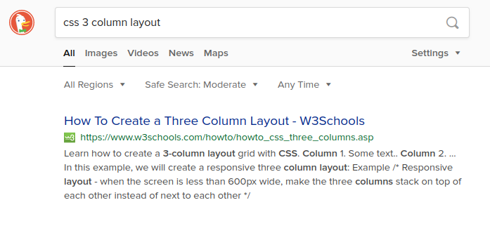
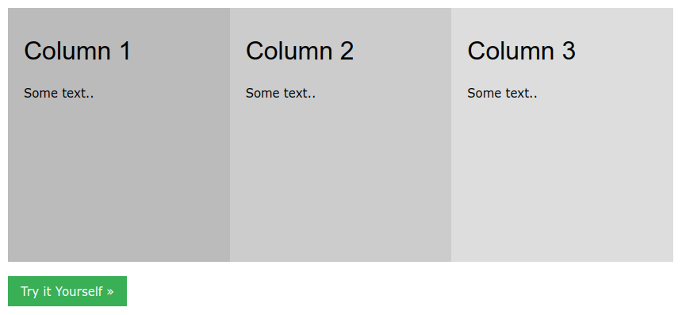

## The Problem

As a beginner, the thought of learning CSS can be extremely daunting. There are
over 500 distinct properties. Let's suppose for ease of math there are 10 values
per property. That's over 5,000 different options to choose from—no wonder it's
overwhelming!

<aside>
  In CSS, a <strong>property</strong> goes on the left-hand side of the colon,
  and a <strong>value</strong> goes on the right-hand side.
  <pre>
    {`
<selector>: {
  <property>: <value>
}
`}
  </pre>
</aside>

When you try to add CSS on your own webpage, things don't seem to look the way
you imagined.

If you're like me, you may lean on CSS frameworks like
[Bootstrap](https://getbootstrap.com/), so you can simply apply a class and the
component becomes beautifully styled.

```html{1}
<!-- Styled with Bootstrap -->
<button class="btn btn-primary">Click me</button>
```

The problem with a CSS framework like Bootstrap is that you will inevitably need
to adjust something in the CSS to fit your design. You are again faced with
writing your own custom CSS. But now, you need to patch your custom CSS to work
alongside the Bootstrap stylesheet.

<aside>
  I'm not trying to pick on Bootstrap. I am just using Bootstrap as an example
  since it is a widely-known CSS framework.
</aside>

## Limit Your Scope


When you're first learning CSS, make it easier on yourself by **limiting your
scope** when it comes to the CSS rules you use.

<aside>
  By limiting your scope, I mean to <strong>limit the number of options</strong>{' '}
  of CSS rules you can apply.
</aside>

This is where [Tailwind CSS](https://tailwindcss.com/docs) comes in. Tailwind
CSS is a utility-first CSS framework. You use classes in your HTML to hook into
predefined CSS rules. With Tailwind, you would style a button like this:

```html
<!-- Styled with Tailwind -->
<button
  class="bg-blue-500 hover:bg-blue-700 text-white font-bold py-2 px-4 rounded"
>
  Button
</button>
```

You might think the first example using Bootstrap looks simpler and easier to
read. I would agree. But our focus is _learning CSS_, and it's going to take a
very long time to learn CSS if you are styling a button by only applying
Bootstrap's `btn` class.

With Tailwind, you are _basically writing CSS_. In the example above, the
classes for the button clearly translate to something along the lines of

```css
/* 
Note: this is CSS-psuedocode
      to give you an idea.
*/
button {
  background-color: shade 500 of blue;
  color: white;
  font-weight: bold;
  padding: a little padding on top/bottom, a little more padding on left/right;
  border-radius: round the corners a little;
}

button:hover {
  background-color: shade 600 of blue;
}
```

It's not important what the actual values are in each CSS rule. Tailwind
provides a carefully created **design system** out of the box. The design system
_limits_ the amount of possible CSS rules you can apply. Moreover, a design
system will force your styles to be more consistent throughout your site.

Tailwind's classes are atomic, and the classes Tailwind defines usually apply a
single CSS rule. So as a side effect of using Tailwind, you are actually
_learning how to use CSS_.

## The Strategy


Assuming I've convinced you to learn CSS with Tailwind, how do you know what
classes to use in order to apply the styles? Let's walk through a scenario as an
example.

### The Scenario

Let's say you want to implement a 3-column layout. The process we will use to
figure this out are as follows:

1. [Search the web](https://duckduckgo.com/?q=css+3+column+layout) to learn how
   to accomplish the task in CSS.
2. [Search Tailwind's docs](https://tailwindcss.com/docs/installation/) to find
   the classes you need to apply the CSS.

Let's go through each of the steps.

After searching on DuckDuckGo, I see the following:



We will choose the first result from W3Schools. Here is their example:



Then, the following HTML:

```html
<div class="row">
  <div class="column"></div>
  <div class="column"></div>
  <div class="column"></div>
</div>
```

and CSS:

```css
.column {
  float: left;
  width: 33.33%;
}

/* Clear floats after the columns */
.row:after {
  content: '';
  display: table;
  clear: both;
}
```

<aside>
  <p>
    As someone learning CSS, I might not know what is going on with the CSS in
    the "row" class. In this case, I would copy and paste the CSS I don't
    understand into a search engine and further investigate.
  </p>
  <p>
    I happen to know this is a&nbsp;
    <ExternalLink href="https://stackoverflow.com/questions/8554043/what-is-a-clearfix">
      clear fix
    </ExternalLink>, which is being used because they are doing the layout using
    floats. Don't worry about this too much. In a&nbsp;
    <a href="#some-advice">later section</a>, I will suggest core topics to
    research when beginning to learn CSS.
  </p>
</aside>

After I see the CSS code, I turn to Tailwind's documentation and search for
**clear fix**. I am immediately taken to a page on **floats**. We apply a clear
fix where class `row` was set previously.

```html
<div class="clearfix">
  <div></div>
  <div></div>
  <div></div>
</div>
```

Then, we look up in the documentation how to apply the rules where the `column`
class used to be.

```html
<div class="clearfix">
  <div class="float-left w-1/3"></div>
  <div class="float-left w-1/3"></div>
  <div class="float-left w-1/3"></div>
</div>
```

We'll add some text to see what this looks like.

```html
<div class="clearfix">
  <div class="float-left w-1/3">1</div>
  <div class="float-left w-1/3">2</div>
  <div class="float-left w-1/3">3</div>
</div>
```

See the demo on [CodePen](https://codepen.io/swkeever/pen/jOWLQgg).

### Strategy Recap

1. Ask yourself what it is you're trying to style.
2. Search the web to learn how to accomplish the task in CSS.
3. Search Tailwind's documentation to find what classes you need to use.
4. Apply the classes in your HTML.

Over time, you will become more familiar which how to do things in CSS and in
Tailwind. Then, this process will become very fast because you won't need to
look things up as often.

<aside>
  I recommend the&nbsp;
  <ExternalLink href="https://marketplace.visualstudio.com/items?itemName=austenc.tailwind-docs">
    Tailwind Docs
  </ExternalLink>
  &nbsp;and&nbsp;
  <ExternalLink href="https://marketplace.visualstudio.com/items?itemName=bradlc.vscode-tailwindcss">
    Tailwind CSS IntelliSense
  </ExternalLink>
  &nbsp;VS Code extensions for easy access to documentation and auto-completion.
</aside>

## Some Advice


There are a few important properties in CSS that you will want to understand.
They are

- Display
- Position
- Margin and padding
- Width and height

There are other important properties, but I emphasize **limiting your scope**
while first learning CSS. The other properties will come up naturally as you
apply [the strategy](#strategy-recap) discussed previously. The ones I list
above are going to critically impact how things are layed out on your site, and
I find they are the properties I am reaching for most of the time.

### Learn the Fundamentals

To get you started, learn about the
[Box Model](https://www.youtube.com/results?search_query=box+model) which is
fundamental to CSS. Next, understand the three most common ways to lay things
out:

- Floats (what we practiced [earlier](#the-scenario))
- Flexbox
- Grid

Learn [Flexbox](https://www.youtube.com/results?search_query=flexbox) to start.
It has [wide support](https://caniuse.com/#feat=flexbox) by browsers and it is
simple to use and apply once you are comfortable with it.

<h3>
  You Got This{' '}
  <span role="img" aria-label="Victory hand">
    ✌️
  </span>
</h3>

_Learning CSS is a constant journey._ Take baby steps and work incrementally.
Search engines are your friend when you get stuck. Tailwind will help you learn
CSS by **limiting your scope**. Moreover, your UIs should improve by utilizing
the design system provided by Tailwind.

Good luck on your journey learning CSS, and most importantly, have fun.


## Additional Reading

If you want a crash course on using Tailwind CSS, check out their
[Designing with Tailwind CSS](https://tailwindcss.com/screencasts/) screencast.

At some point, your CSS skills may not be what's holding you back. You may need
to learn some principles of web design.
[Refactoring UI](https://refactoringui.com/) is a quick read that is jam-packed
with tactical advice that you can immediately start applying to your designs.
For a taste, check out
[7 Practical Tips for Cheating at Design](https://medium.com/refactoring-ui/7-practical-tips-for-cheating-at-design-40c736799886).
