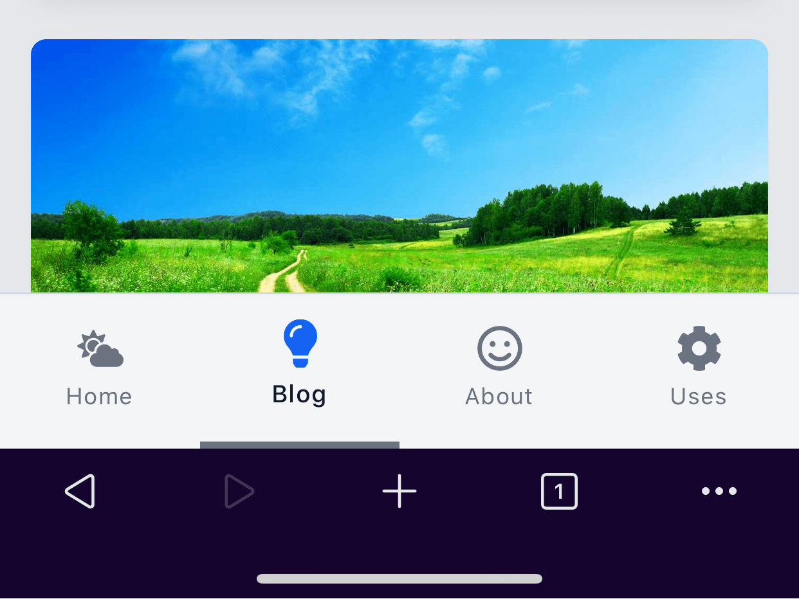
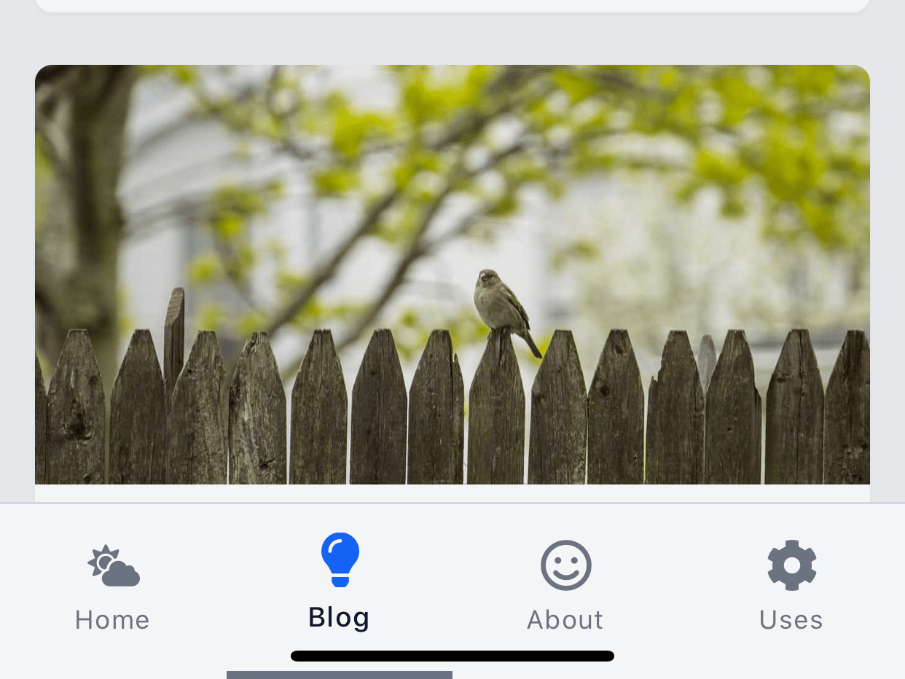
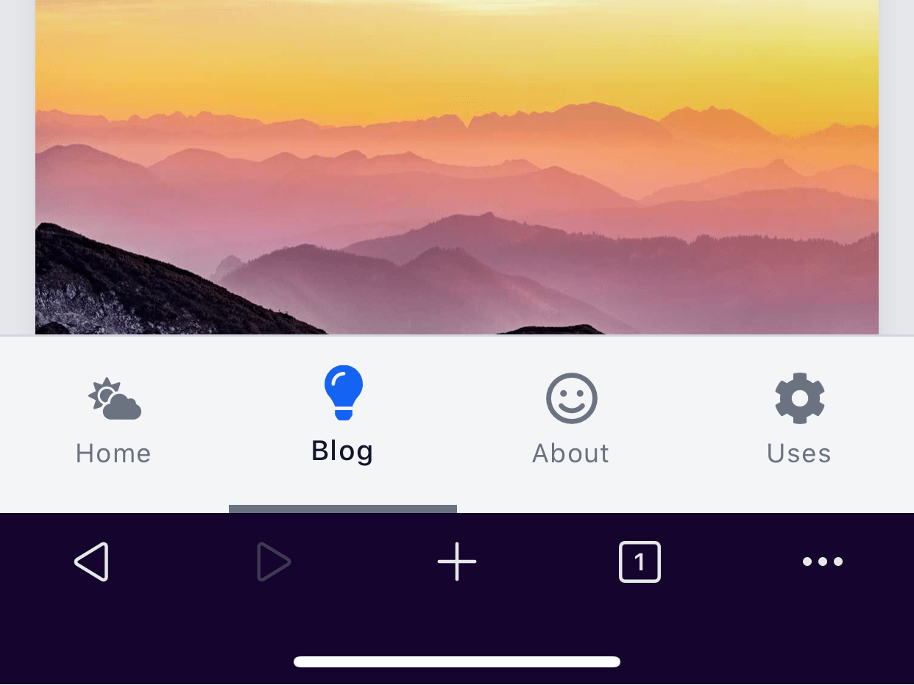
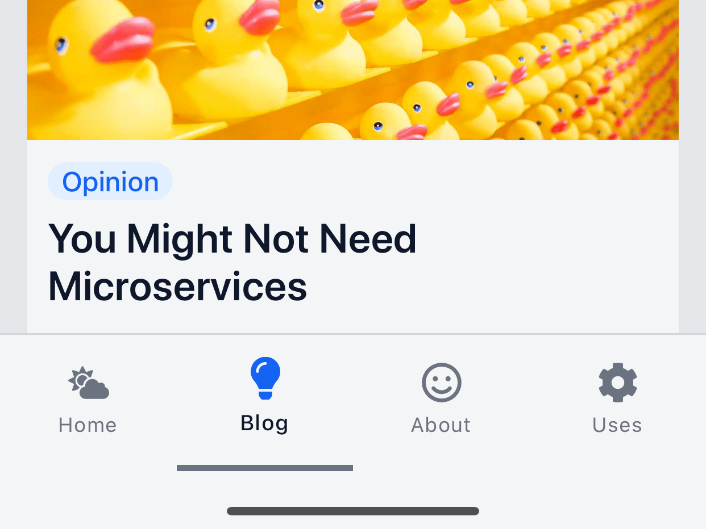

## Problem

> **Note**
>
> This article assumes an iOS device. But I'd be curious to know if you're on
> Android and get the same issue.

Let's say your design has a bottom navbar on mobile-sized screens.

Something like this:



This looks fine.

However, when we start scrolling down, the mobile browser's bottom menu goes away
making our navbar tuck under the device's home-slider at the bottom.



We don't want that.

**Luckily, the fix is simple.**

## Solution

We'll add the following utility class:

```css
/* This adds extra bottom padding on mobile browsers */
.safe-bottom {
  padding-bottom: env(safe-area-inset-bottom);
}
```

> Read more about `env()` on
> [MDN](https://developer.mozilla.org/en-US/docs/Web/CSS/env).

Next, we'll apply the class to our navigation menu.

```xml
<!-- Assume this is where your nav menu is -->
<header class="safe-bottom">
  <!-- More stuff would likely go here -->
</header>
```

In our HTML document's `head`, we also need to set the following:

```xml
<!-- Put this in your document `head` -->
<meta
  name="viewport"
  content="width=device-width, initial-scale=1.0, viewport-fit=cover"
/>
```

Now, when we scroll up, the navbar looks unchanged.



But **when we scroll down, we get a little extra padding** to make way for the
home slider.



That's all there is to it!

Hope this helps you build a better mobile experience for your users.

Let me know on [Twitter](https://twitter.com/swkeever) if you want me to do more
content like this.
