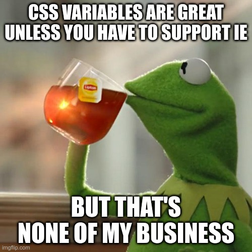

## Introduction

React makes no opinions on how developers should write CSS. The choice for how
CSS should be written in our applications is ultimately on us, the developers.

I've thought a lot about the various ways we could go about writing CSS in our
React projects.

The ideal CSS workflow should support

- **A design system**—invaluable for making our designs look consistent and
  polished.
- **Productivity**—our workflow should facilitate rapid development.
- **Scalable**—we want to be sure our CSS strategy scales with our project in
  terms of performance and robustness.

So with this, let's consider the most basic starting point.

## CSS

The most obvious solution to how we could write CSS in React is by writing...
Well... CSS.

> What's great about plain old CSS is that it is extremely portable. It is a
> common tongue us frontend web developers must agree upon.

We also have no problem developing a design system using
[CSS variables](https://developer.mozilla.org/en-US/docs/Web/CSS/Using_CSS_custom_properties).



Where we start to see problems with vanilla CSS is with productivity and
scalability.

There is no nesting syntax with vanilla CSS so selectors can sometimes be
repetitive.

```css
.btn {
  /* regular styles */
}

.btn:hover {
  /* hover styles */
}

.btn:active {
  /* active styles */
}

.btn:focus {
  /* focus styles */
}
```

There is also the problem with global stylesheets becoming unwieldy as the
project grows.

<aside>
  <p>
    In programming, we should be conscious <em>any time</em> we declare anything
    globally. This is because other parts of the application could clash with
    the globally declared thing causing strange bugs.
  </p>
</aside>

We want to find a solution that will make us more productive and hopefully solve
issues such as scope.

To address these 2 problems, we turn to
[CSS Modules](https://github.com/css-modules/css-modules).

## CSS Modules

One of the big selling points with CSS Modules is having the ability to have CSS
scoped to a particular component, making our styling system more robust as the
project grows.

```css
/* button.module.css */
.btn {
  background-color: blue;
  color: white;
}
```

```jsx
// button.jsx
import styles from './button.module.css';

function Button() {
  return <button className={styles.btn}>Click</button>;
}
```

It is also possible to add [Sass](https://sass-lang.com/) support alongside CSS
Modules, giving us the benefits of using Sass—arguably one of the most mature
CSS preprocessors.

```scss
/* button.module.scss */
.btn {
  // regular styles

  &:hover {
    // hover styles
  }

  &:active {
    // active styles
  }
}
```

The problem for me comes in the form of productivity. With CSS Modules, we would
need to hop back and forth between CSS and JavaScript files.

With React, we co-locate our JavaScript and HTML together in the same file, why
shouldn't we also co-locate our CSS?

<aside>
  <p>
    Technically with React we're writing JSX, not HTML. But JSX is effectively
    emulating HTML.
  </p>
</aside>

With this, let's consider some CSS-in-JS solutions.

## CSS as Objects

The most straightforward way of writing CSS-in-JS is by using the object syntax
and injecting that into the style attribute.

```jsx
// Using object syntax to write styles
function Button() {
  return (
    <button
      style={{
        backgroundColor: 'blue',
        color: 'white',
        padding: '5px 2px',
      }}
    >
      Click
    </button>
  );
}
```

The design system can be handled via exporting JavaScript constants.

```jsx
import styles from '@styles';

function Button() {
  return (
    <button
      style={{
        backgroundColor: styles.colors.blue,
        color: styles.colors.white,
        padding: styles.padding.button,
      }}
    >
      Click
    </button>
  );
}
```

Scoping is handled naturally because we just inject the styles inline.

One thing I'm personally not a fan of is the camelcase object syntax. If we ever
decided to port the object syntax into regular CSS, then that would be a huge
effort since CSS doesn't use camelcase syntax.

Let's keep considering other CSS-in-JS options.

## CSS in Template Strings

Another popular way to write CSS in React is by writing CSS syntax inside of
template strings.

```jsx
// via styled-components documentation, linked below

const Button = styled.a`
  display: inline-block;
  border-radius: 3px;
  padding: 0.5rem 0;
  margin: 0.5rem 1rem;
  width: 11rem;
  background: transparent;
  color: white;
  border: 2px solid white;
`;
```

There are several libraries that let us do this:

- [styled-components](https://styled-components.com/)
- [Emotion](https://emotion.sh/docs/introduction)
- [styled-jsx](https://github.com/vercel/styled-jsx)

Admittedly, having so many options that accomplish a similar thing in a similar
way makes it hard to choose one.

<aside>
  <p>
    Have you tried all three of the libraries I listed? Which do you prefer and
    why? Let me know on{' '}
    <ExternalLink href="https://twitter.com/swkeever">Twitter</ExternalLink>.
  </p>
</aside>

We may also take a small
[performance hit](https://blog.primehammer.com/the-performance-of-styled-react-components/)
writing styles using a library like this, abeit it's probably not too
significant. Nonetheless, it's something we should consider as our application
grows.

At this point, we've looked at a lot of great options. However, all of the options
we've looked at so far require us to develop our design system upfront. Let's
see if we can find a tool that could help us in that regard as well.

## Opinionated CSS Framework

Let's consider some of the more opinionated CSS frameworks such as
[Bootstrap](https://getbootstrap.com/) or
[Material UI](https://material-ui.com/).

What's great about frameworks like this is that the design system is built-in.

This can let us be extremely productive because classes are defined that we can
use to style our components quickly.

```jsx
// Using Bootstrap for example
const Button = () => <button className="btn btn-primary">Click</button>;
```

Of course, if we use Bootstrap, we have to consider the possibility of having
our site look like
[every other website that uses Bootstrap](https://www.dagusa.com/).

I think these frameworks are great for prototyping but may become a bottleneck
as our project grows.

What if the CSS framework doesn't provide the functionality for a specific use
case? We'll have to inject our own styles alongside the framework's styles.
What's more, we'd need to make sure the styles we add our consistent with the
design system provided by the CSS framework.

It's great that we can style our app quickly by applying classes, but let's look
for a solution that gives us more granular control.

For this, we turn to [Tailwind CSS](https://tailwindcss.com/).

## Unopininated CSS Framework

Tailwind CSS is a JavaScript application that uses a configuration file to
generate a stylesheet full of utility classes.

We can then use the generated classes like any other CSS stylesheet.

```jsx
<h1 className="text-lg font-bold text-red-700">Hello</h1>
```

To me, **Tailwind CSS fits somewhere in the middle between an opinionated CSS
framework and writing CSS from scratch**.

You get the benefits of being able to add classes to the HTML to apply styles
quickly, but Tailwind doesn't make too many decisions about how things should
look.

What's more, all of the other options (other than the opinionated CSS
frameworks) required that _we_ come up with the design system upfront. Tailwind
provides that for us.

This is great because _I'm not a designer_.

Why not let someone _who is a designer_
([Steve Schoger](https://twitter.com/steveschoger)) create a design system for
us?

> **Question**
>
> _If we're using the design system provided by Tailwind, wouldn't we have the
> same problem as Bootstrap? Wouldn't sites start to look like they were built
> with Tailwind?_
>
> Yes and no.
>
> Yes, many Tailwind users will probably not override the default design system
> configuration. For instance, we'll probably see the same color palettes being
> used in many websites.
>
> But unlike Bootstrap, Tailwind doesn't specify _how_ you should apply the
> design system.
>
> With Bootstrap, you would apply a `btn` class to a button, which would create
> a [Bootstrap button](https://getbootstrap.com/docs/4.0/components/buttons/).
>
> With Tailwind, however, you would need to apply individual classes for
> padding, border-radius, background color, etc. This gives developers much more
> control over how the component should look.

We should have no problems with scalability because at the end of the day,
Tailwind is just generating CSS. They also have a story for
[controlling the file size](https://tailwindcss.com/docs/controlling-file-size)
from the generated CSS.

This checks all the boxes. **Tailwind provides a design system engine and a
means to rapidly apply CSS rules in our components.**

Tailwind CSS is not perfect though, and the approach of writing styles from
utility classes is
[certainly controversial](https://adamwathan.me/css-utility-classes-and-separation-of-concerns/).

When writing Tailwind CSS, it is not uncommon to see a huge string of class
names.

```jsx
<button className="px-4 py-2 bg-blue-500 hover:bg-blue-600 shadow-md hover:shadow-lg ...">
  Click
</button>
```

Many classes on a single line admittedly can become hard to read.

One solution inspired by Tailwind Labs developer
[Robin Malfait](https://twitter.com/malfaitrobin) is to write a simple function
that joins the classes together.

```javascript
function classNames(...classes) {
  return classes.filter(Boolean).join(' ');
}
```

Original source code
[here](https://github.com/tailwindlabs/tailwindui-react/blob/develop/src/utils/class-names.ts).

We can call this function when declaring many classes, and we can easily span
large strings of classes across multiple lines in a readable way.

I like to group related CSS rules together, but do what works for you.

```jsx
<button
  classNames={classNames(
    'px-4 py-2',
    'bg-blue-500 hover:bg-blue-600',
    'shadow-md hover:shadow-lg'
  )}
>
  Click
</button>
```

## Conclusion

Tailwind CSS is a great complement to React. After using Tailwind,

- I have become [more confident](/blog/learn-css) with my CSS skills.
- I spend less time styling than if I were to write CSS from scratch.
- I can utilize a design system making my styles, such as spacing and colors,
  consistent throughout my site.

It's probably going to be the tool I reach for to handle my CSS needs in future
projects.

**What is your preferred way to write CSS with React?** Let me know on
[Twitter](https://twitter.com/swkeever)!
