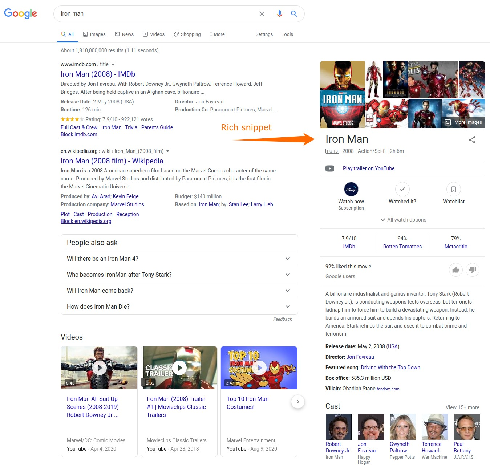
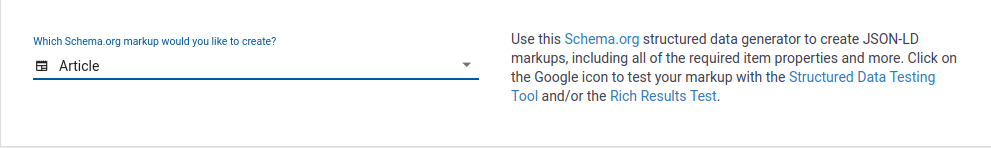
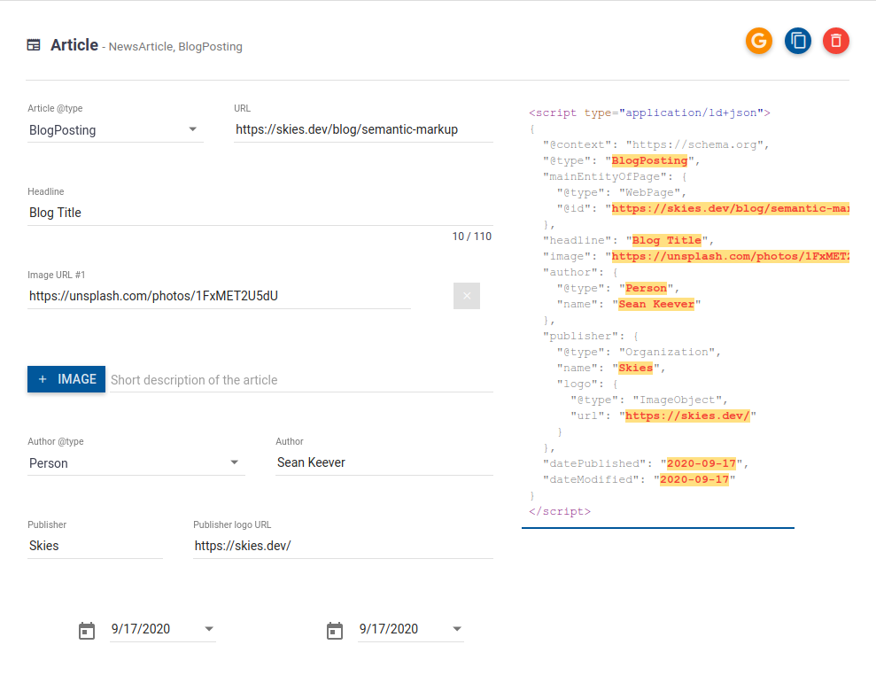
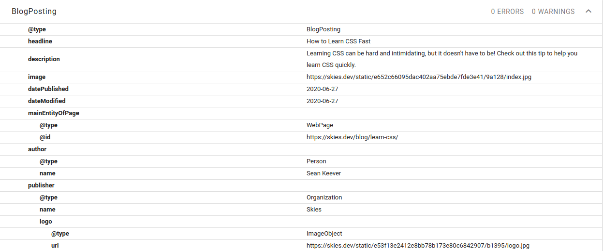

## What is Schema.org

[Schema.org](https://schema.org/) is a system developed by Google, Microsoft,
Yahoo, and Yandex to **give search engines the ability to easily understand our
sites.**

We provide information about our sites in the form of **standardized schemas**.

Because the schemas are standard, search engines are able to easily parse the
schemas in order to learn about our site.

What's more, these schemas are how search engines are able to provide **rich
snippets** in search engine result pages.



> **Note**
>
> I do not guarantee that your content will show up in Google as rich snippets
> if you follow these steps. I'm not in control of Google's search engine
> algorithms. 🙃
>
> But adding schema markup will surely get you closer by providing Google and
> other search engines with the information they need to create those rich
> snippets.

Schema.org offers several formats to write our schemas including

- RDFa
- Microdata
- JSON-LD\*

[Google recommends JSON-LD](https://developers.google.com/search/docs/guides/intro-structured-data)
so that is what we are going to focus on here.

## How to Apply Schema.org Schema Markup to Your Site

Let's learn how to apply schema markup to our site with an example—we will add
schema markup for blog posts. Our examples will be in React, but you should be
able to follow along with whatever technology you're using to develop your site.
If anything is unclear, please
[reach out to me on Twitter](https://twitter.com/swkeever) and ask for
clarification.

If you prefer videos and want an example in Gatsby, check out this excellent
explanation by
[Guiding Digital](https://www.youtube.com/channel/UCpJHkuyhTtGrelk9kVDVUlg).

https://www.youtube.com/watch?v=BIQGBKXc6AI

**Let's get started.**

First thing, let's head over to the
[Schema Markup Generator](https://technicalseo.com/tools/schema-markup-generator/).

I want to create the markup for a blog post so I will select _Article_.



At this point, we see the boilerplate markup generated.

I recommend going through and filling out this form especially for all the
fields with dropdown menus since those are standardized values that search
engines expect. Some of the other fields, like _Headline_, we will probably set
that in code with a variable so I will just enter a placeholder value for now.



Perfect.

Let's copy the JSON that was generated and place it into our JavaScript
application.

```jsx
import React from 'react';

export default function BlogPosting() {
  const schema = {
    '@context': 'https://schema.org',
    '@type': 'BlogPosting',
    mainEntityOfPage: {
      '@type': 'WebPage',
      '@id': 'https://skies.dev/blog/semantic-markup',
    },
    headline: 'Blog Title',
    image: 'https://unsplash.com/photos/1FxMET2U5dU',
    author: {
      '@type': 'Person',
      name: 'Sean Keever',
    },
    publisher: {
      '@type': 'Organization',
      name: 'Skies',
      logo: {
        '@type': 'ImageObject',
        url: 'https://skies.dev/',
      },
    },
    datePublished: '2020-09-17',
    dateModified: '2020-09-17',
  };

  // the rest of the function not shown...
}
```

I'll try not to make too many opinions about how you're sourcing data in
your application, but you might want to set most of these fields dynamically
with variables.

```jsx
import React from 'react';

export default function BlogPosting({ blog }) {
  const schema = {
    '@context': 'https://schema.org',
    '@type': 'BlogPosting',
    mainEntityOfPage: {
      '@type': 'WebPage',
      '@id': blog.url,
    },
    headline: blog.title,
    image: blog.image.url,
    author: {
      '@type': 'Person',
      name: blog.author,
    },
    publisher: {
      '@type': 'Organization',
      name: 'Skies',
      logo: {
        '@type': 'ImageObject',
        url: 'https://skies.dev/',
      },
    },
    datePublished: blog.datePublished,
    dateModified: blog.dateModified,
  };

  // the rest of the function not shown...
}
```

I'll leave it up to you and your application's needs to determine which fields
should be set dynamically and which should be static.

Now that we have our schema ready, we can inject it into the `<head>` of our
document.

The way I like to do this is with an `SEO` component. The `SEO` component is
where I put everything that goes in the `<head>` including things like
`<title>`, `<meta>` tags, and now—our _schema markup_.

> Check out [Gatsby's docs](https://www.gatsbyjs.com/docs/add-seo-component/) to
> see an example of an `SEO` component if you've never written one before.

We pass our schema object into the `SEO` component as follows.

```jsx
import React from 'react';
import SEO from './SEO';

export default function BlogPosting({ blog }) {
  const schema = {
    '@context': 'https://schema.org',
    '@type': 'BlogPosting',
    mainEntityOfPage: {
      '@type': 'WebPage',
      '@id': blog.url,
    },
    headline: blog.title,
    image: blog.image.url,
    author: {
      '@type': 'Person',
      name: blog.author,
    },
    publisher: {
      '@type': 'Organization',
      name: 'Skies',
      logo: {
        '@type': 'ImageObject',
        url: 'https://skies.dev/',
      },
    },
    datePublished: blog.datePublished,
    dateModified: blog.dateModified,
  };

  return (
    <article>
      <SEO schema={schema} />

      {/* The rest of the code not shown for brevity... */}
    </article>
  );
}
```

Then, inside of our `SEO` component, we convert the JavaScript object into JSON.
This is the format search engine crawlers expect.

Also note, since we are coding this up in React, we are using the
[react-helmet](https://github.com/nfl/react-helmet) library to handle injecting
elements into the `<head>` of our application.

```jsx
import React from 'react';
import { Helmet } from 'react-helmet';

export default function SEO({ schema }) {
  return (
    <Helmet>
      {/* Probably more <meta> tags and what not would go here */}

      <script type="application/ld+json">{JSON.stringify(schema)}</script>
    </Helmet>
  );
}
```

And that's pretty much all there is to it to get you started using schema markup
in your web apps!

Now we can head over to Google's
[Structured Data Testing Tool](https://search.google.com/structured-data/testing-tool/u/0/)
to make sure everything is working.



As we can see, there are 0 errors and 0 warnings so everything looks good to go.
👍

I hope you found this article helpful. If anything was unclear,
please don't hesitate to [reach out on Twitter](https://twitter.com/swkeever)
and ask for clarification.

## References

- [Schema Markup Generator](https://technicalseo.com/tools/schema-markup-generator/)
- [Structured Data Testing Tool](https://search.google.com/structured-data/testing-tool/u/0/)
- [MOZ Schema.org Markup documentation](https://moz.com/learn/seo/schema-structured-data)
- [Google's documentation on structured data](https://developers.google.com/search/docs/guides/intro-structured-data)
- [Adding an SEO component in Gatsby](https://www.gatsbyjs.com/docs/add-seo-component/)
- [react-helmet](https://github.com/nfl/react-helmet)
