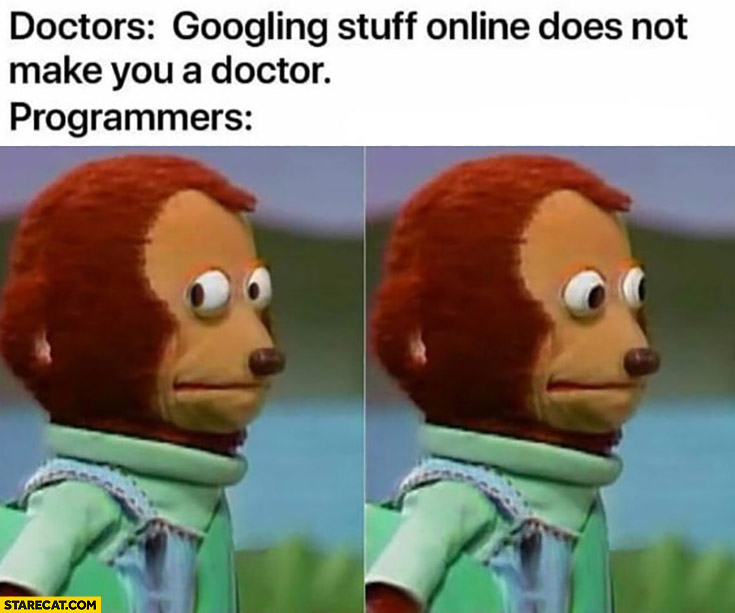

## Why Start a Blog

It's a reasonable question. What is the point of even having a blog in the first
place?

I can't speak for everyone, but in this article, I will explain the reasons I
personally started the Skies blog. After reading, hopefully you will have a
better understanding of why blogging could be useful.

### TL;DR

I developed the Skies blog to

- have my own place on the web to let people know what I'm doing
- have a development and design playground
- help myself and others learn

With that said, let's jump right in!

## Discoverability

I developed the Skies blog because I wanted to build an online presence for
myself. When you Google my name, you can be taken to my blog and see what I'm up
to.

This can be beneficial for people interested in working with me because they can
see my blog and get a better understanding of what I know, and what I don't
know!

Compare this to a resume, where all I have are bullet points to try and explain
myself. A blog gives me a platform to write about things I've done in a longer,
more complete format.

Sure, I could just go to Facebook, LinkedIn, or wherever and post content there.
But I like having my own site because it lets me have more control of the
content I publish and the user experience of the site.

This leads directly into my next point.

## Customizability

People interested in my work can come to my site and immediately see something
I've built. Moreover, it's probably more fun for the user to have a unique
experience visiting a custom site rather than seeing the same
Facebook/LinkedIn/whatever layout they've already seen a million times.

Also, I'm a developer, so building my own site from scratch gives me the
flexibility to do things the way I like. For example, all my blogs are written
in Markdown (more specifically, [MDX](https://mdxjs.com/)), which lets me

1. Format my writing super easily and quickly
2. Render the Markdown as HTML.
3. Boom. We have a web page!

I also _enjoy_ web design and front-end web development. The Skies site is a
playground for me to try out my design ideas. If I want to support dark mode,
then I can support dark mode.

I like being able to know I can expand the site to my heart's content.

## Education

Another benefit I see from writing a blog, and maybe the benefit that is most
important for me, is having a platform to help others. As a developer, I am
looking things up _all the time_.

Writing about things I'm working on and learning about gives me an opportunity
to give back to the community. Maybe a blog I write can help someone in the
future.

Not only that, the way I see it, the benefits go both ways. There is a common
saying that

> the best way to learn something is to teach it.

Well, writing a blog can accomplish that!

I notice when I'm writing an instructional blog, I often have to check myself
and question _my own_ understanding of a subject before I can feel confident
teaching others. In doing so, I am learning the subject more in-depth myself.
Win-win.

## How to Blog

So those are my reasons for starting this blog. If this blog and my reasons have
enticed you so that you want to blog and share your awesome story with the
world, then oh do I have a treat for you.

There are many different ways you could go about breaking into blogging. It can
even be a bit overwhelming with all the options. Let's look at a few different
options that I recommend to help you narrow your search.

### WordPress

[WordPress](https://wordpress.org/) is an extremely popular tool for blogging
and for building websites in general. According to VentureBeat,
[WordPress now powers 30% of websites](https://venturebeat.com/2018/03/05/wordpress-now-powers-30-of-websites/#:~:text=WordPress%20now%20powers%2030%20percent,percent%20mark%20in%20November%202015.).

I believe WordPress gives you a lot of flexibility to customize your site
without requiring a strong background in web development. Take that with a grain
of salt though, this is just what I've heard from other people. I have never
actually used WordPress myself.

### Gatsby

[Gatsby.js](https://www.gatsbyjs.org/) is what I'm using to power Skies!

<aside>
  

    I have another blog post where I explain the&nbsp;
    <ExternalLink href="/blog/tech-stack">tech stack</ExternalLink>&nbsp;I used for
    the Skies website.
  

</aside>

I recommend Gatsby if you are a developer and you want to have full control over
the site.

Gatsby utilizes React. But don't worry if you prefer to use a different
framework, there is probably a similar tool you can use that accomplishes the
same goal. For instance, [Gridsome](https://gridsome.org/) for Vue.js.

### Medium

You've probably heard of or read blogs on [Medium](https://medium.com/). This
would be a good platform if you don't want to have to think about building
anything. You just want a platform to blog on, and you want it _now_.

I also think posting on Medium could be your fastest path to SEO glory since
Medium is an established platform already. I don't have any real data to back
that up, so again, take that with a nice grain of salt.

If you use Medium, you won't have the flexibility to control the user experience
of the whole site, but that may or may not be an issue for you. Perhaps you
trust the UX designers that work full-time at Medium more than you trust your
own design decisions. I understand.

Whatever platform you choose, go in there and just have fun with it. Go tell the
world your unique perspective on whatever it is you want to tell.
