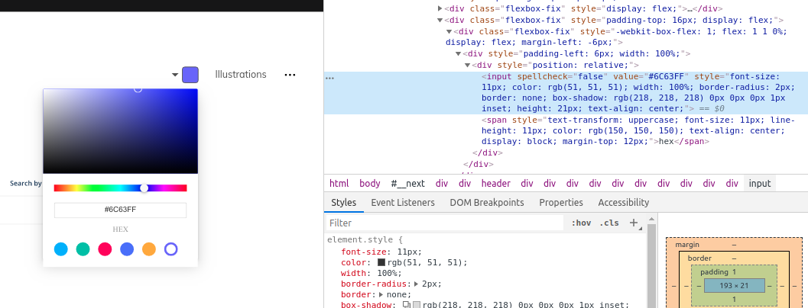

## Introduction

[unDraw.co](https://undraw.co/) is an amazing tool for free vector graphics. All
of the graphics you see on this site are sourced from unDraw.

A cool feature of unDraw is it lets you put in a hex value for your brand's
color. This way, you the SVG you source from unDraw will be consistent with your
site's colors.

Unfortunately, unDraw defaults to a purple color every time you refresh the
page. So every time you go to unDraw, you have to reenter your brand color hex
code.

We want to extend the functionality of unDraw by caching our brand color in
`localStorage`. When you visit unDraw, we will use JavaScript to inject our
brand color into unDraw automatically.

## Getting started

First thing I want to do is inspect the HTML for the color picker.

I need to select the `input` element that is a child of the `div` with class
`page__colorSelector__switch`.
