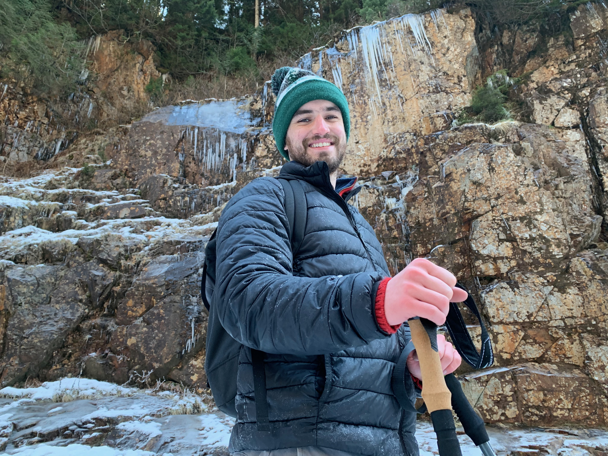
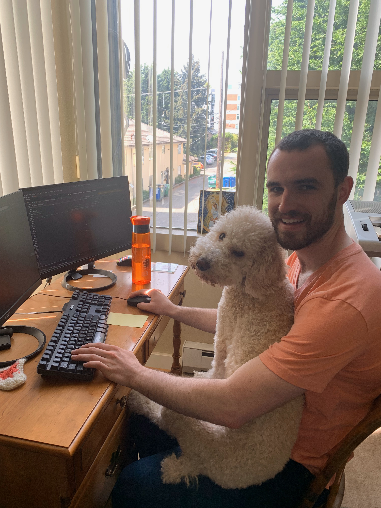
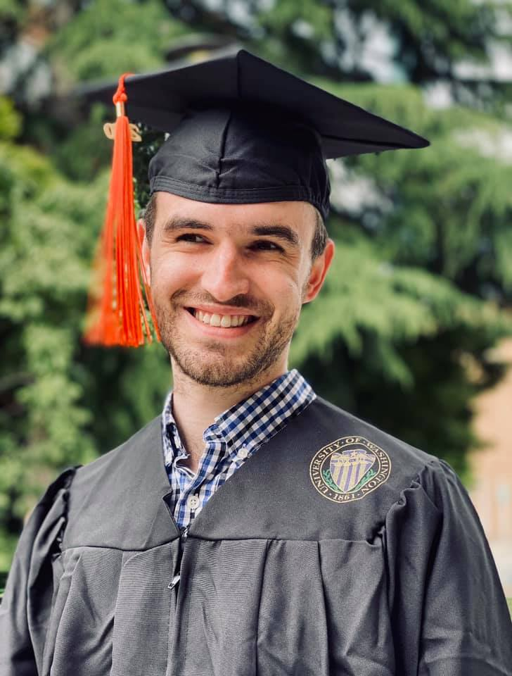
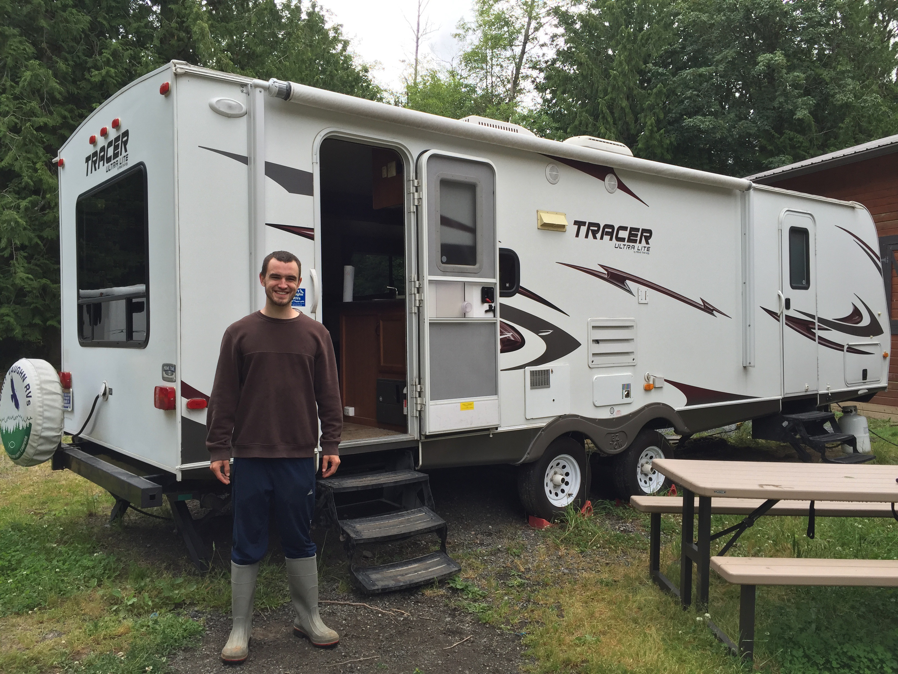
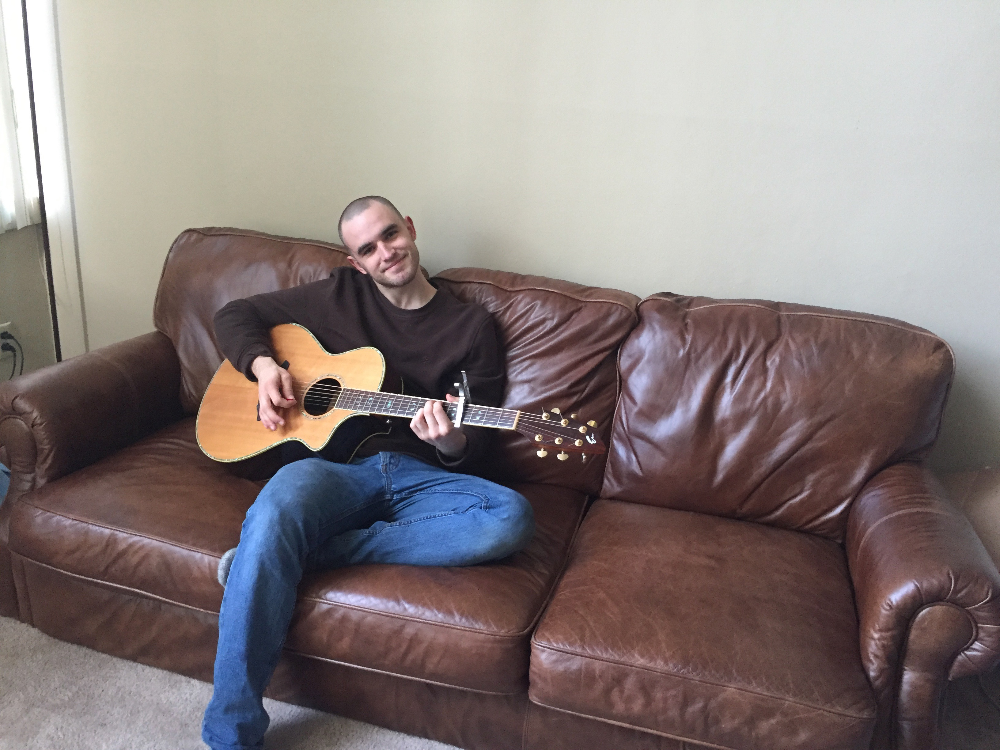
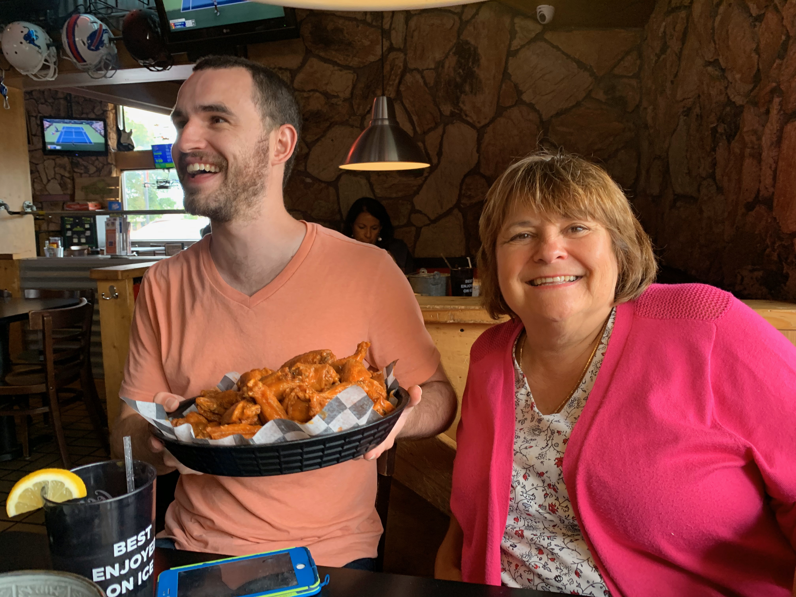

import Img from 'gatsby-image';

# About

My name is **Sean Keever**. I'm a software engineer.

I live with my partner [Mary Osetinsky](https://twitter.com/maryosetinsky) in
Seattle, WA.

I have a dog, Milo.

We do pair programming together.

I graduated from the University of Washington with a bachelor's degree in
Computer Engineering.

I worked on a farm to help pay for college. I wrote about it in my
[personal statement](/personal-statement) for admission to UW.

I enjoy rowing.

Music.

And hot wings.

I'm currently working at OfferUp. I work with the Discovery team—responsible for
search within the app.

Got a question for me? Ask me on [Twitter](https://twitter.com/swkeever).
