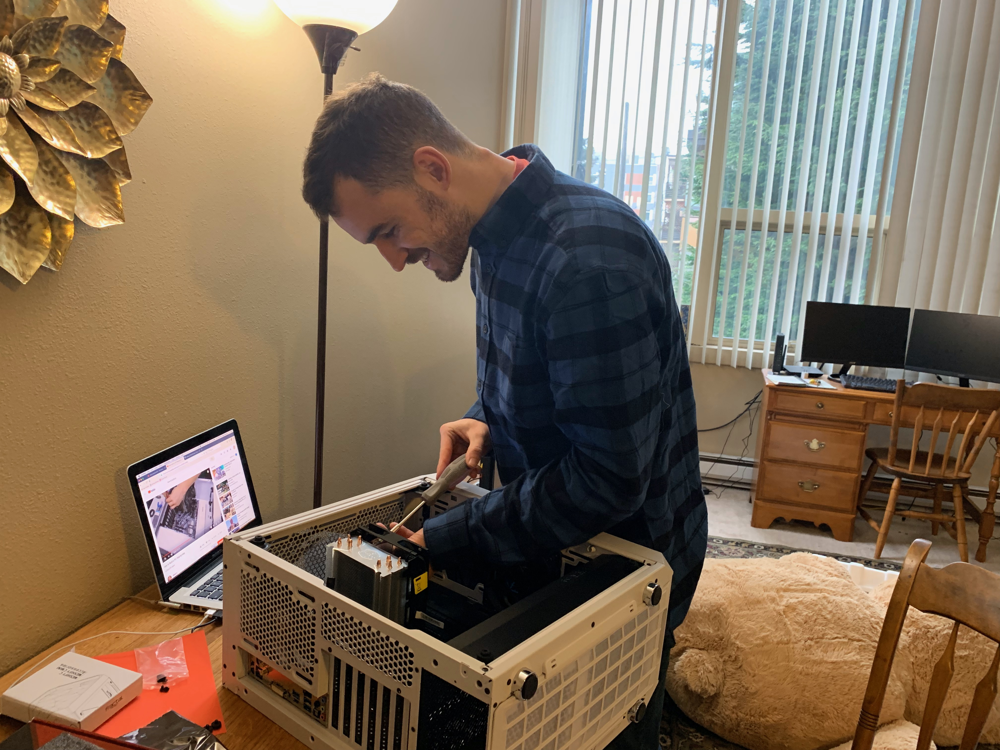

# Uses

Inspired by [Wes Bos](https://wesbos.com), welcome to my
[Uses](https://uses.tech/) page.

In this page, I list out **various tools and technologies I use on a daily
basis.**

Let me know if you have any questions about any of them.

## Computer

I built my computer with the following parts:

- [Ubuntu 18.04 OS](https://releases.ubuntu.com/18.04/)
- [Intel Core i7-8700K CPU](https://www.amazon.com/dp/B07598VZR8/?coliid=I20VF38PXSG2Y&colid=1IPZOY1QYC6KZ&psc=0&ref_=lv_ov_lig_dp_it)
- [16GB Corsair Vengeance DRAM](https://www.amazon.com/dp/B0134EW7G8/?coliid=IVOX10GURDSQ5&colid=1IPZOY1QYC6KZ&psc=1&ref_=lv_ov_lig_dp_it)
- [Cooler Master Hyper 212 Evo CPU Cooler](https://www.amazon.com/dp/B005O65JXI/?coliid=I2UZ0V0DUTT6X6&colid=1IPZOY1QYC6KZ&psc=1&ref_=lv_ov_lig_dp_it)
- [ASRock Z370 Motherboard](https://www.amazon.com/dp/B0767KFYJ5/?coliid=I3KV30K1T5J1DF&colid=1IPZOY1QYC6KZ&psc=0&ref_=lv_ov_lig_dp_it)
- [Fractal Design Meshify Mini Case](https://www.amazon.com/Fractal-Design-FD-CA-MESH-C-WT-TGC-Computer-Case/dp/B07BPP9KYD)

## Editor and IDE

I like [Visual Studio Code](https://code.visualstudio.com/) as a general purpose
editor. Especially for

- Web development
- Scripting
- General-purpose text editing

For compiled languages such as Java, I think
[JetBrains](https://www.jetbrains.com/) IDEs are great.

If I need a terminal-based editor, I prefer [Vim](https://www.vim.org/).

## Desktop Apps

My go-to desktop apps, in addition to the editors/IDEs listed above, are

- [Brave](https://brave.com/) as my everyday browser.
- [Spotify](https://www.spotify.com/us/) for music.
- [Discord](https://discord.com/) for chatting with friends and dev communities.
- [VMWare](https://www.vmware.com/) for using Windows on Linux.

## Desk Setup

- [Jarvis](https://www.fully.com/standing-desks/jarvis-adjustable-height-desk-bamboo.html)
  standing desk.
- 2
  [Dell UltraSharp 27" monitors](https://www.dell.com/en-us/work/shop/dell-ultrasharp-27-monitor-u2719d/apd/210-arcv).
- A cheap Dell keyboard that I got at Goodwill.
- [Wireless M510 Mouse](https://www.logitech.com/en-us/product/wireless-mouse-m510)
